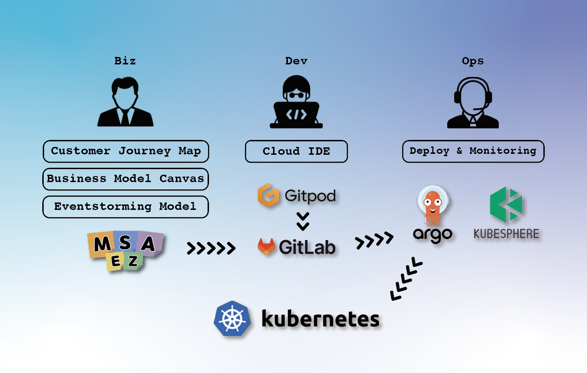

# Welcome to DXEZ Platform

Digital Transformation can be made easy only by good Biz-Dev-Ops' experiences

<figure><figcaption><p>Overview of DXEZ Platform</p></figcaption></figure>

### Features and Scenarios:

```
. Exploring business opportunities (personas, customer journey maps, business model canvas)
. Event storming modeling (process modeling, software modeling)
. Generate code from the model and push the generated model to gitlab.
. The pushed code is developed online through gitpod linked to gitlab.
. gitlab CI - Build occurs simultaneously with gitlab push.
. Create a container image
. Provides a testing sandbox for each developer using kind
. If the build is successful, deploy to the developer's Kubernetes cluster (Argo CD)
. Check the status of deployed microservices through kubersphere
```
