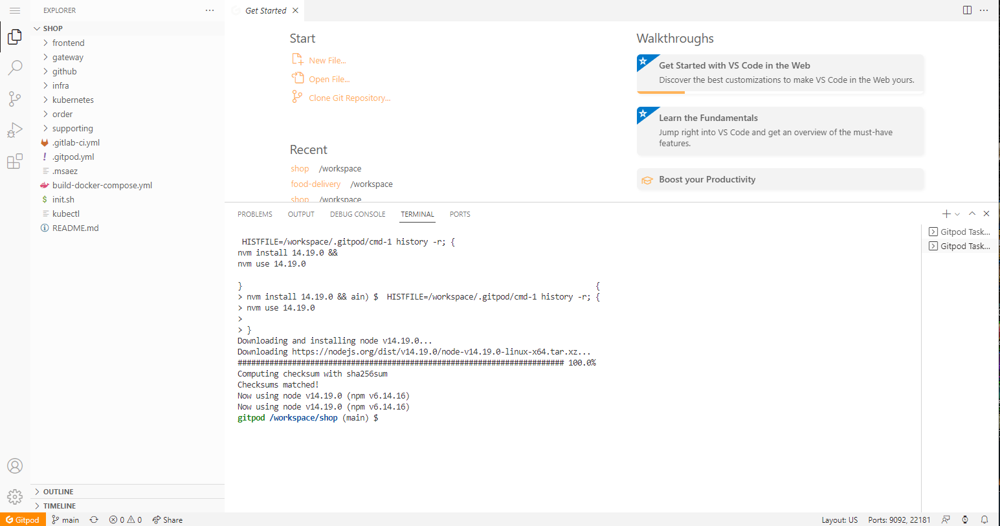

# 테스트


Model Link


1. Model 생성 후, 상단의 **Code** Click
2.  코드 생성 후, **Push To Git** Click\

    

    1. 최초 실행시) Gitlab Login 하여 Token 발급
3.  Repository 생성 (**Create**) \

    

    1.  이미 존재 시, The Repository name already Exist -> **Next**\

        
    2.  Repository를 이미 생성 한 경우, 변경된 코드가 있다면 **Push**\

        <figure><figcaption></figcaption></figure>

4.  **IDE** Tab ->  Open GitPod Click하여 GitPod 실행\

    <figure><figcaption></figcaption></figure>
